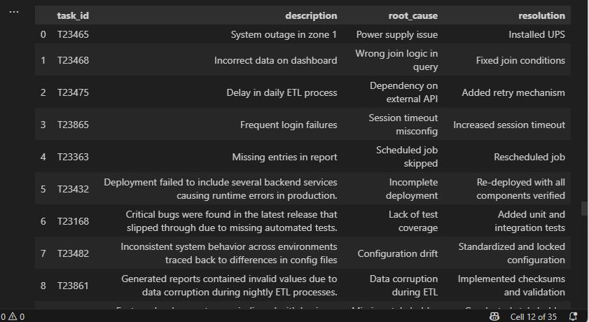
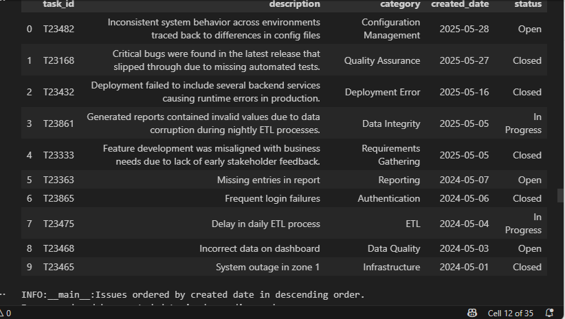

# Project Title: Data Issue Tracking and Root Cause Analysis
# Author: Kiruthikaa NS

This project aims to analyze a relational database tracking technical issues and their corresponding analyses. By utilizing Python and SQL, we seek to identify patterns, trends, and insights from structured data, gaining a deeper understanding of issue frequency, resolution status, and the types of analysis performed. The project highlights SQL integration with Python for effective data exploration and informed decision-making.

## Project Structure

datafun-05-sql-project/
│
├── data/
│   └── project.sqlite3    
├── project_data/
│   └── analysis.csv  
│   └── issues.csv         # SQLite database file
│
├── sql_create/
│   └── 01_project_drop_tables.sql    # Full workflow in Jupyter notebook
│   └── 02_project_create_tables.sql 
    └── 01_project_insert_records.sql 
├── sql_queries/
│   └── sql_eda_project.ipynb     # Full workflow in Jupyter notebook
│
├── utils_logger.py                       # Centralized logging
└── README.md                              # This file


## Tools and Libraries

- SQLite3  
- pandas  
- matplotlib  
- seaborn  
- textwrap  
- logging  


## Features and Workflow

### 1. Database Setup

- Defined two tables: `issues` and `analysis`
- Established foreign key relationships
- Populated with 10 sample entries each
  
  
  
  

### 2. SQL Queries and Joins

- Joined both tables to identify root causes, delays, and patterns
 

- Aggregated resolution time by type of analysis 
  
   

- Found distinct values by category
  
  

- Grouped by category
  
  

- Listed the issue in Descending order by Date
  
  

- Deleted Records
  
  
  
- Updated Records
- 
  
### 3. Visualizations  

- Bar chart displaying average resolution time by analysis type  
- Pie chart illustrating the distribution of issue statuses
    
  

### 4. Feature Engineering  

- Created a `days_to_resolve` feature using `JULIANDAY` date difference  
- Incorporated custom observations based on status distribution 
  
   


## Insights  

- 50% of issues are classified as closed  
- Configuration and data quality issues are common root causes  
- Resolution duration varies significantly by root cause  
- Issues lacking early feedback or proper testing tend to have longer resolution times  

### Conclusion  

This analysis provides valuable insights into issue resolution delays, root causes, and team performance using structured queries and visual summaries.  

### Next Steps  

- Implement SLA thresholds to flag overdue tasks  
- Automate daily ingestion of new issue records  
- Enhance dashboard with real-time metrics  
- Develop a model to predict resolution delays  

## How to Run  

```bash
# Step 1: Run setup script
python scripts/create_tables_and_insert.py

# Step 2: Launch Jupyter and open analysis notebook
jupyter notebook notebooks/analysis_notebook.ipynb
```

---

## Requirements  

```bash
pip install pandas matplotlib seaborn ipython
```

### Push updates to Remote Repository
    git add .
	git commit -m "Completed EDA SQL Query Project"
	git push origin main

## Acknowledgements

Special Thanks To:
Dr.Case for her guidance and support
Open Source Contributors for essential license and tools. 

## Author  

This project is part of the **DataFun** project series, designed for hands-on data analysis and engineering using Python and SQL.
