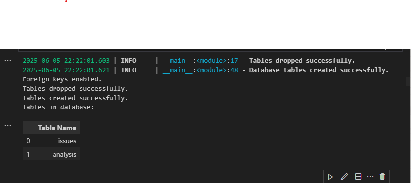

# Data Issue Tracking and Root Cause Analysis

The purpose of this project is to explore and analyze a relational database that tracks technical issues and their corresponding analyses. Using Python and SQL, we aim to uncover patterns, trends, and insights from the structured data to better understand issue frequency, resolution status, and the types of analysis performed. This will demonstrate the integration of SQL with Python for effective data exploration and decision support.

## Project Structure

```

datafun-05-sql-project/
│
├── data/
│   └── project.sqlite3    
├── project_data/
│   └── analysis.csv  
│   └── issues.csv         # SQLite database file
│
├── sql_create/
│   └── 01_project_drop_tables.sql    # Full workflow in Jupyter notebook
│   └── 02_project_create_tables.sql 
    └── 01_project_insert_records.sql 
├── sql_queries/
│   └── sql_eda_project.ipynb     # Full workflow in Jupyter notebook
│
├── utils_logger.py                       # Centralized logging
└── README.md                       # This file

````

---
```
## Tools and Libraries

- SQLite3
- pandas
- matplotlib
- seaborn
- textwrap
- logging

---

## Features and Workflow

### 1. Database Setup

- Defined two tables: `issues` and `analysis`
- Established foreign key relationships
- Populated with 10 sample entries each

**Screenshot: Table schema and sample records**




### 2. SQL Queries and Joins

- Joined both tables to identify root causes, delays, and patterns
- Aggregated resolution time by type of analysis

**Screenshot: Query results (task, root cause, resolution)**  


**Screenshot: Avg days to resolve by analysis type**  


---

### 3. Visualizations

- Bar chart showing average resolution time by analysis type
- Pie chart displaying distribution of issue statuses

**Screenshot: Status Pie Chart**  


**Screenshot: Resolution Time by Analysis Type**  


---

### 4. Feature Engineering

- Created a `days_to_resolve` feature using `JULIANDAY` date difference
- Added custom observations based on status distribution

---

## Insights

- 50% of issues are marked as closed
- Configuration and data quality issues were common
- Resolution duration varies significantly by root cause
- Issues lacking early feedback or proper testing tend to take longer

---

## Conclusion and Next Steps

### Conclusion

This analysis helped understand delays in issue resolution, root causes, and team performance using structured queries and visual summaries.

### Next Steps

- Add SLA thresholds to flag overdue tasks
- Automate daily ingestion of new issue records
- Extend dashboard to include real-time metrics
- Train a model to predict likely delayed resolutions

---

## How to Run

```bash
# Step 1: Run setup script
python scripts/create_tables_and_insert.py

# Step 2: Launch Jupyter and open analysis notebook
jupyter notebook notebooks/analysis_notebook.ipynb
````

---

## Requirements

```bash
pip install pandas matplotlib seaborn ipython
```

---

## project_output

Place these in a `/project_output` folder:

* `issues_analysis_preview.png`
* `sql_join_output.png`
* `avg_days_resolution.png`
* `status_pie_chart.png`
* `resolution_time_bar.png`

---

## Author

This project is part of the **DataFun** project series for hands-on data analysis and engineering using Python and SQL.

